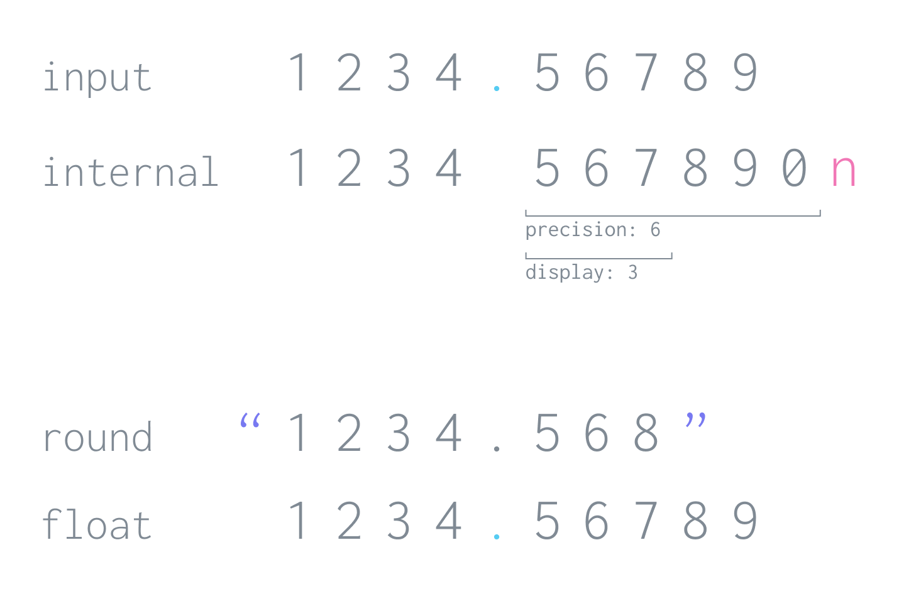

<div align="center" markdown="1">


# पेसा

</div>

A money handling library for JavaScript that can handle USD to VEF conversions for Jeff without breaking a sweat!

---

```javascript
const money = pesa(135, 'USD').add(25).to('INR', 75);

money.round(2);
// '12000.00'
```

> Why should I use this, when I can just do all of this with plain old JavaScript numbers?!

Because JavaScript numbers full of fun foibles such as these:

```javascript
0.1 + 0.2;
// 0.30000000000000004

9007199254740992 + 1;
// 9007199254740992
```

Using them for financial transactions will most likely lead to technical bankruptcy [[1](#credits)].

_(check this talk by [Bartek Szopka](https://www.youtube.com/watch?v=MqHDDtVYJRI) to understand why JS numbers are like this)_

**`pesa`** circumvents this by conducting scaled integer operations using JS [`BigInt`](https://github.com/tc39/proposal-bigint) instead of `Number`. This allows for arithmetic involving arbitrarily large numbers with unnecessarily high precision.

## Index

<details>
<summary><code>show/hide</code></summary>

1. [Installation](#installation)
2. [Usage](#usage)
   1. [Initialization](#initialization)
   2. [Currency and Conversions](#currency-and-conversions)
   3. [Immutability](#immutability)
   4. [Chaining](#chaining)
3. [Documentation](#documentation)
   1. [Arithmetic Functions](#arithmetic-functions)
   2. [Comparison Functions](#comparison-functions)
   3. [Check Functions](#check-functions)
   4. [Other Calculation Functions](#other-calculations-functions)
   5. [Display](#display)
   6. [Chainable Methods](#chainable-methods)
   7. [Non Chainable Methods](#non-chainable-methods)
   8. [Internals](#internals)
4. [Additional Notes](#additional-notes)
   1. [Storing The Value](#storing-the-value)
   2. [Non-Money Stuff](#non-money-stuff)
   3. [Support](#Support)
   4. [Precision vs Display](#precision-vs-display)
   5. [Why High Precision](#why-high-precision)
   6. [Implicit Conversions](#implicit-conversions)
   7. [Use Cases](#use-cases)
5. [Alternatives](#alternatives)

</details>

## Documentation Index

<details>
<summary><code>show/hide</code></summary>

1. [Arithmetic Functions](#arithmetic-functions)
   - [Arguments](#arguments-arithmetic)
   - [Return](#return-arithmetic)
   - [Operations](#operations-arithmetic)
2. [Comparison Functions](#comparison-functions)
   - [Arguments](#arguments-comparison)
   - [Return](#return-comparison)
   - [Operations](#operations-comparison)
3. [Check Functions](#check-functions)
   - [Operations](#operations-check)
4. [Other Calculation Functions](#other-calculations-functions)
   - [`percent`](#percent)
   - [`split`](#split)
   - [`abs`](#abs)
5. [Display](#display)
   - [`float`](#float)
   - [`round`](#round)
   - [`store`](#store)
6. [Chainable Methods](#chainable-methods)
   - [`currency`](#currency)
   - [`rate`](#rate)
   - [`clip`](#clip)
   - [`copy`](#copy)
7. [Non Chainable Methods](#non-chainable-methods)
   - [`getCurrency`](#getcurrency)
   - [`getConversionRate`](#getconversionrate)
   - [`hasConversionRate`](#hasconversionrate)
8. [Internals](#internals) - [Numeric Representation](#numeric-representation) - [Conversion Rates](#conversion-rates)
</details>

## Installation

For `npm` users:

```bash
npm install pesa
```

For `yarn` users:

```bash
yarn add pesa
```

[Index](#index)

## Usage

```javascript
pesa(200, 'USD').add(250, 'INR', 75).percent(50).round(3);
// '9475.000'
```

This section describes the usage in brief. For more details, check the [Documentation](#documentation) section. For even more details, check the source code or raise an issue.

[Index](#index)

### Initialization

To create an initialize a money object you can either use the constructor function `pesa`:

```javascript
import { pesa } from 'pesa';

const money = pesa(200, 'USD');
// OR
const money = pesa(200, options);
```

or the constructor function maker `getMoneyMaker`, this can be used if you don't want to set the options everytime you call `pesa`:

```javascript
import { getMoneyMaker } from 'pesa';

const pesa = getMoneyMaker('USD');
// OR
const pesa = getMoneyMaker(options);

const money = pesa(200);
```

#### Options and Value

**Options** are optional, but currency has to be set before any conversions can take place.

```typescript
interface Options {
  bankersRounding?: boolean; // Default true, use bankers rounding instead of traditional rounding.
  currency?: string; // Default '', Three letter alphabetical code in uppercase ('INR').
  precision?: number; // Default 6, Integer between 0 and 20.
  display?: number; // Default 3, Number of digits .round defaults to.
  rate?: RateSetting | RateSetting[]; // Default [], Conversion rates
}

interface RateSetting {
  from: string;
  to: string;
  rate: string | number;
}
```

**Value** can be a `string`, `number` or a `bigint`. If value is not passed the value is set as 0.

```typescript
type Value = string | number | bigint;
```

If `bigint` is passed then it doesn't undergo any conversion or scaling and is used to set the internal `bigint`.

```javascript
pesa(235).internal;
// { bigint: 235000000n, precision: 6 }

pesa('235').internal;
// { bigint: 235000000n, precision: 6 }

pesa(235n).internal;
// { bigint: 235n, precision: 6 }
```

### Currency and Conversions

A numeric value isn't money unless a currency is assigned to it.

#### Setting Currency

Currency can be assigned any time before a conversion is applied.

```javascript
// During initialization
const money = pesa(200, 'USD');

// After initialization
const money = pesa(200).currency('USD');
```

#### Setting Rates

To allow for conversion between two currencies, a conversion rate has to be set. This can be set before the operation or during the operation.

```javascript
// Rate set before the operation
pesa(200).currency('USD').rate('INR', 75).add(2000, 'INR');

// Rate set during the operation
pesa(200).currency('USD').add(2000, 'INR', 0.013);
```

#### Conversion

The result of an operation will always have the currency on the left (USD in the above example). To convert to a currency:

```javascript
// Rate set during the operation
money.to('INR', 75);

// Rate set before the operation
money.to('INR');
```

This returns a new `Money` object.

> Does it provide conversion rates?

**`pesa`** doesn't provide or fetch conversion rates. This would cause dependencies on exchange rate APIs and async behaviour. There are a lot of exchange rate apis such as [Coinbase](https://api.coinbase.com/v2/exchange-rates), [VAT Comply](https://vatcomply.com/), [European Central Bank](https://www.ecb.europa.eu/stats/eurofxref/eurofxref-daily.xml?b743fd808a34daf65f9ac9d63a9538f9), and [others](https://github.com/public-apis/public-apis#currency-exchange).

### Immutability

The underlying value or currency of a `Money` object doesn't change after an operation.

```javascript
const a = pesa(200, 'USD');
const b = pesa(125, 'INR').rate('USD', 0.013);
const c = a.add(b);

// Statements below will evaluate to true
a.float === 200;
b.float === 125;
c.float === 201.625;

a.getCurrency() === 'USD';
b.getCurrency() === 'INR';
c.getCurrency() === 'USD';
```

### Chaining

Due to the following two points:

1. All arithmetic operation (`add`, `sub`, `mul` and `div`), create a new `Money` object having the values that is the result of that operation.

2. All setter methods (`currency`, `rate`), set the value of an internal parameter and return the calling `Money` object.

Methods can be chained and executed like so:

```javascript
pesa(200)
  .add(22)
  .currency('USD')
  .sub(33)
  .rate('INR', 75)
  .mul(2, 'INR')
  .to('INR')
  .round(2);
// '377.99'
```

[Index](#index)

## Documentation

Calling the main function `pesa` returns an object of the `Money` class.

```typescript
const money: Money = pesa(200, 'USD');
```

The rest of the documentation pertains to the methods and parameters of this class.

### Arithmetic Functions

Operations that involve the value of two `Money` objects and return a new `Money` object as the result.

Function signature

```typescript
[operationName](value: Input, currency?: string, rate?: number) : Money;

type Input = Money | number | string;
```

Example:

```javascript
money = pesa(200, 'USD');

money.add(150).round();
// '350.000'

money.sub(150, 'INR', 0.013);
// '198.050'
```

_**Note**: The `rate` argument here is from the `currency` given in the function to the calling objects `currency`. So in the above example `rate` of 0.013 is for converting `'INR'` to `'USD'`. The reason for this is to prevent precision loss due to reciprocal._

#### Arguments (arithmetic)

| name       | description                                                                                                                                                                   | example        |
| ---------- | ----------------------------------------------------------------------------------------------------------------------------------------------------------------------------- | -------------- |
| `value`    | This is compulsory. If input is a string then `'_'` or `','` can be used as digit separators, but decimal points should always be `'.'`. Scientific notation isn't supported. | `'200_000.00'` |
| `currency` | If value is a different currency from the calling object's currency then currency should be passed. Any arbitrary combination of 3 letters in uppercase can be a `currency`.  | `'VEF'`        |
| `rate`     | Required only if the calling object or `value` doesn't have the rate set. `rate` is the conversion rate between the calling object's `currency` and `value`'s `currency`      | `450_000`      |

#### Return (arithmetic)

All arightmetic operations return a new `Money` object that inherits the calling object's options, i.e. `currency`, `precision` and `display`.

#### Operations (arithmetic)

| name  | description                 | example            |
| ----- | --------------------------- | ------------------ |
| `add` | addition, i.e. a + b        | `pesa(33).add(36)` |
| `sub` | subtraction, i.e. a - b     | `pesa(90).sub(21)` |
| `mul` | multiplication, i.e. a \* b | `pesa(23).mul(3)`  |
| `div` | division, i.e. a / b        | `pesa(138).div(2)` |

### Comparison Functions

Operations that compare two values and return a boolean.

Function Signature:

```typescript
[operationName](value: Input, currency?: string, rate?: number) : boolean;

type Input = Money | number | string;
```

Example:

```javascript
money = pesa(150, 'INR');

money.eq(2, 'USD', 75);
// true

money.lte(200);
// true
```

_**Note**: The `rate` argument here is from the `currency` given in the function to the calling objects `currency`. So in the above example `rate` of 75 is for converting `'USD'` to `'INR'`. The reason for this is to prevent precision loss due to reciprocal._

#### Arguments (comparison)

See the **Arguments** table under the **Arithmetic** section.

#### Return

`Boolean` indicating the result of the comparison.

#### Operations (comparison)

| name  | description                                                                              | example            |
| ----- | ---------------------------------------------------------------------------------------- | ------------------ |
| `eq`  | checks if the two amounts are the same, i.e. `===`                                       | `pesa(20).eq(20)`  |
| `neq` | checks if the two amounts are not the same, i.e. `!==`                                   | `pesa(20).neq(19)` |
| `gt`  | checks if calling object amount is greater than passed amount, i.e. `>`                  | `pesa(20).gt(19)`  |
| `lt`  | checks if calling object amount is less than passed amount, i.e. `<`                     | `pesa(20).lt(21)`  |
| `gte` | checks if calling object amount is greater than or equal to the passed amount, i.e. `>=` | `pesa(20).gte(19)` |
| `lte` | checks if calling object amount is less than or equal to passed amount, i.e. `<`         | `pesa(20).lte(21)` |

### Check Functions

Functions that return a `boolean` after evaluating the internal state.

Function signature:

```typescript
[checkName](): boolean;
```

Example:

```typescript
pesa(200, 'USD').isPositive();
// true

pesa(0, 'USD').isZero();
// true

pesa(-200, 'USD').isNegative();
// true
```

#### Operations (check)

| name         | description                                            |
| ------------ | ------------------------------------------------------ |
| `isPositive` | Returns true if underlying value is greater than zero. |
| `isZero`     | Returns true if underlying value is zero.              |
| `isNegative` | Returns true if underlying value is less than zero.    |

### Other Calculation Functions

#### `percent`

Function that returns another `Money` object having a percent of the calling objects value.

Function signature

```typescript
percent(value: number): Money;
```

Example

```javascript
pesa(200, 'USD').percent(50).round(2);
// '100.00'
```

#### `split`

Function that splits the underlying value into given list of percentages or `n` equal parts and returns an array of `Money` objects.

The sum of `values` can exceed `100`. Argument `round` is used to decide at what precision the sum of all returned will equate to the calling objects value. If `round` is not passed then the calling object's `display` value is used.

Function signature:

```typescript
split(values: number | number[], round?: number): Money[];
```

Example:

```javascript
pesa(200.99)
  .split([33, 66, 1])
  .map((m) => m.float);
// [66.327, 132.653, 2.01]

pesa(200.99)
  .split([33, 66, 1], 2)
  .map((m) => m.float);
// [66.33, 132.65, 2.01]

pesa(100)
  .split(3)
  .map((m) => m.float);
// [33.333, 33.333, 33.334]
```

#### `abs`

Returns a `Money` object having the the absolute value of the calling money object.

Function signature:

```typescript
abs(): Money;
```

Example:

```javascript
pesa(-2).abs().eq(2);
// true

pesa(2).abs().eq(2);
// true
```

#### `neg`

Returns a `Money` object having the the negated value of the calling money object.

Function signature:

```typescript
neg(): Money;
```

Example:

```javascript
pesa(-2).neg().round();
// '2.000'

pesa(2).neg().round();
// '-2.000'
```

### Display

Functions and parameters used to display the `Money` object's value.

> Does this support formatting?

Nope, but you can use the [ECMAScript Internationalization API](https://developer.mozilla.org/en-US/docs/Web/JavaScript/Reference/Global_Objects/Intl/NumberFormat/NumberFormat) to handle formatting for you. The `NumberFormat` constructor can be configured to your needs then you can pass `Money#float` to it's format method.

```javascript
const numberFormat = new Intl.NumberFormat('en-US', {
  style: 'currency',
  currency: 'USD',
});
const money = pesa(2000, 'USD');

numberFormat.format(money.float);
// '$2,000.00'
```

#### `float`

Returns the JS Number form of the underlying value.

Function signature:

```typescript
float: number;
```

Example:

```javascript
pesa(200).float;
// 200
```

#### `round`

Rounds the underlying value and returns it, this function is not susceptible to JS number foibles. If `to` is not passed it uses the `display` amount.

Function Signature:

```typescript
round(to?: number): string
```

Example:

```javascript
pesa(200).round(2);
// '200.00'
```

#### `store`

Property that displays a precision intact string representation of the value.

```javascript
pesa(200, { precision: 7 }).store;
// '200.0000000'
```

### Chainable Methods

These methods are used to set some value and return the `Money` object itself so that other functions can be called on it.

#### `currency`

This is used to set the currency after initialization. Currency can be set only once so if currency has been set, this function will not change it.

Function signature:

```typescript
currency(value: string): Money;
```

Example:

```javascript
pesa(200).currency('INR');
```

#### `rate`

This is used to set a single or multiple conversion rates. If input is a string then it is assumed that the conversion rate is from the calling objects `currency` to the string `input` passed as the first parameter with a value of `rate`. You can be more explicit by passing an object.

Function signature:

```typescript
rate(input: string | RateSetting | RateSetting[], rate?: Rate):

interface RateSetting {
  from: string;
  to: string;
  rate: string | number;
}
```

Example:

```javascript
// string input
pesa(200, 'INR').rate('USD', 75);

// RateSetting input
pesa(200, 'INR').rate({ from: 'INR', to: 'USD', rate: 75 });

// RateSetting[] input
pesa(200, 'INR').rate([
  { from: 'INR', to: 'USD', rate: 75 },
  { from: 'USD', to: 'INR', rate: 0.013 },
]);
```

#### `clip`

Used to receive a copy of the calling object with the internal representation rounded off to the given place.

Function signature:

```typescript
clip(to: string): Money;
```

Example:

```javascript
const money = pesa(7500, 'INR').to('USD', 1 / 75);

money.round();
// '99.998'

const clipped = money.clip(2);
clipped.round();
// '100.000'

clipped.internal;
// { bigint: 100000000n, precision: 6 }
```

#### `copy`

Returns a copy of it self.

Function signature:

```typescript
copy(): Money;
```

Example;

```javascript
pesa(200).copy().round();
// '200.000'
```

### Non Chainable Methods

These methods are used to retrieve some value from the `Money` object.

#### `getCurrency`

This will return the set currency of the money object. If nothing is set then `''` is returned.

Function signature;

```typescript
getCurrency(): string
```

Example:

```javascript
pesa(200, 'INR').getCurrency();
// 'INR'
```

#### `getConversionRate`

This will return the stored conversion rate for the given arguments. If no conversion rate is found, it will throw an error. If conversion rate is stored for _from A to B_, fetching the conversion rate for _from B to A_ will return the reciprocal unless it is explicitly set.

Function signature:

```typescript
getConversionRate(from: string, to:string): string | number
```

Example

```javascript
const money = pesa(200, 'INR').rate('USD', 75);

money.getConversionRate('INR', 'USD');
// 75

money.getConversionRate('USD', 'INR');
// 0.013333333333333334
```

#### `hasConversionRate`

Will return true if either conversion rates _from A to B_ or _from B to A_ is found.

Function signature:

```typescript
hasConversionRate(to: string): boolean;
```

Example:

```javascript
pesa(200, 'USD').rate('INR', 75).hasConversionRate('INR');
// true
```

### Internals

These values can be used for debugging.

_Note: altering the returned values won't change the values stored in the `Money` object, these are copies._

#### Numeric Representation

To view the internal numeric representation, the **`.internal`** attribute can be used.

```javascript
pesa(201).internal;
// { bigint: 201000000n, precision: 6 }
```

#### Conversion Rates

To view the stored conversion rates, the **`.conversionRate`** attribute can be used.

```javascript
pesa(200, 'USD').rate('INR', 75).conversionRate;
// Map(1) { 'USD-INR' => 75 }
```

The returned object is that of the javascript `Map` class, which has the following key format `${fromCurrency}-${toCurrency}`. The value may be a `string` or `number`.

[Index](#index)

## Additional Notes

Additional notes pertaining to this lib.

### Storing The Value

Since a `Money` constitutes of 2 values for the number: 1. the `precision`, and 2. the `value`. Storing this would require two cells, but this would be incredible stupid cause fractional numbers have already solved this with the decimal point.

We can use the `store` property to get a string representation where the mantissa length gives the precision irrespective of the significant digits.

```javascript
pesa(0, { precision: 4 }).store;
// '0.0000'
```

You still have to deal with the `currency` though. Also if your db doesn't have a decimal type (I'm looking at you SQLite), then you'll have to store this as a string and cast it before operations.

### Non-Money Stuff

Because of these two points:

1. A number is considered as money only when a currency is attached to it.
2. **`pesa`** allows deferring currency until conversion is required.

**`pesa`** can be used for non monetary operations for when high precision is required or you want to circumvent the foibles of JS `number`.

```javascript
pesa(0.1).add(0.2).eq(0.3);
// true

pesa(9007199254740992).add(1).round(0);
// '9007199254740993'
```

### Support

Since **`pesa`** is built for high precision and large numbers that can exceed `Number.MAX_SAFE_INTEGER` it is dependent on `BigInt` so if your environment doesn't support `BigInt` you will have to rely on some other library.

Check this chart for more info: [`BigInt` Browser compatibility](https://developer.mozilla.org/en-US/docs/Web/JavaScript/Reference/Global_Objects/BigInt#browser_compatibility)

### Precision vs Display

A short note on the difference between the two in the context of **`pesa`**.



Essentially:

- **Precision** refers to how many digits are stored after the decimal point.
- **Display** refers to how many digits are shown after the decimal point when `.round` is called.

Ideally this number would be the same as the minor unit value of a currency. For example if currency is USD the minor is 2, the same for INR. The problem arises when the amount is to be multiplied with another amount having a fractional component such as in the case of conversion.

```javascript
pesa(333, 'INR').to('USD', 0.013).float;
// 4.329
```

If in the above example `precision` were set to 2 it would mess up the calculations because 0.013 gets rounded to 0.01 since input `precision` is matched to internal precision.

```javascript
pesa(333, { currency: 'INR', precision: 2 }).to('USD', 0.013).float;
// 3.33
```

So the number you want to adjust is `display` which doesn't mess up the internal representation.

```javascript
const money = pesa(333, { currency: 'INR', display: 2 }).to('USD', 0.013);

money.round();
// '4.33'

money.float;
// 4.329
```

### Why High Precision

The reason why you would want to conduct your operations in high precision is because: say you make 10,000 INR to USD conversions at 0.013 then that's a difference 10 USD that is added in due to rounding:

```javascript
const oneConversion = pesa(333).mul(0.013).round(2);
// '4.33'

pesa(oneConversion).mul(10000).round(2);
// '43300.00'
```

as opposed to:

```javascript
pesa(333).mul(0.013).mul(10000).round(2);
// '43290.00'
```

i.e. someone is losing money that they shouldn't be.

Now this can't be solved entirely for the same reason that 1/3 in base 10 is 0.3 with the 3 recurring ad infinitum, but in base 3 it would be 0.1. But this can be mitigated by using high precision. Which means that someone will always loose money they shouldn't be but we can control the extent to which they do.

### Implicit Conversions

In **`pesa`** if you provide the conversion _from A to B_, the conversion rate _from B to A_ is implied, i.e. the reciprocal of the former.

This means that chained conversions will cause value loss:

```javascript
pesa(100, 'USD').round();
// '100.000'

pesa(100, 'USD').to('INR', 75).round();
// '7500.000'

pesa(100, 'USD').to('INR', 75).to('USD').round();
// '99.998'
```

There are two ways to alleviate this until there's a proper solution:

#### 1. Increase `precision` or decrease `display`:

```javascript
pesa(100, { currency: 'USD', precision: 7 }).to('INR', 75).to('USD').round();
// '100.000'

pesa(100, { currency: 'USD', display: 2 }).to('INR', 75).to('USD').round();
// '100.00'
```

in both the above cases the internal representation would represent a fractional value.

#### 2. Use `clip` to maintain internally rounded values:

```javascript
const clipped = pesa(100, 'USD').to('INR', 75).to('USD').clip(2);

clipped.internal;
// { bigint: 100000000n, precision: 6 }

clipped.round();
// '100.000'
```

### Use Cases

Hyper-realistic use cases designed to showcase the capabilities of **`pesa`**.

_Disclaimer: all characters, places and events in this `README.md` are entirely fictional. Any resemblances to real characters, places, and events are purely coincidental._

#### Mega Jeff in Venezuela

Imagine Jeff was a million times as powerful, we can call him `megaJeff`, his bank being a whopping 200 quadrillion USD:

```javascript
const megaJeff = pesa('200_000_000_000_000_000.18', 'USD');
```

(_`megaJeff` is too powerful for JS numbers to handle accurately and hence we must rely on string for input._)

and decided to emigrate to Venezuela at the height of it's hyper-inflation, requiring him to convert his USD to VEF:

```javascript
const megaJeffInVenezuela = megaJeff.to('VEF', 451_853.23);
```

this is a conversion that JS numbers can't handle without resorting to dirty tricks such as _E notation_.

```javascript
200_000_000_000_000_000.18 * 451_853.23;
// 9.037064599999999e+22
```

Which is why you need **`pesa`**.

```javascript
megaJeffInVenezuela.round(4);
// '90370646000000000081333.5814'
```

#### Alan the Seed Seller

Alan sells seeds. He lives in Venezuela. Alan doesn't trust his dirty government, they messed up his currency. So Alan conducts his dealings only in BTC. Compared to VEF, BTC is less volatile. Seeds are precious, Alan is parsimonious. Alan likes to record the flow of each seed:

```javascript
const numberOfSeeds = 101_234_318;

const options = { currency: 'BTC', precision: 30 };
const costPerSeed = pesa('0.000000031032882086386885', options); // ~3 satoshis
```

Say he wants to calculate the total value of his seeds:

```javascript
const totalvalue = costPerSeed.mul(numberOfSeeds);

totalValue.round(24);
// '3.141592653589793387119430'
```

if he were to rely on clumsy old JS number:

```javascript
0.000000031032882086386885 * 101_234_318;
// 3.1415926535897936
```

he would end up loosing almost 30% of his very significant digits. Any one who deals in BTC knows that it is very bad to loose one's digits.

Say he wanted to find out the value of his seeds in USD, which at the time of writing has the conversion rate of 60951.60 from BTC.

```javascript
totalValue.to('USD', 59379.3).round(30);
// '186545.572655304418471780769799000000'
```

were he to rely on JS number, he would end up with a number that—having lost more than 40% of it extremely significant digits—is completely detached from reality:

```javascript
0.000000031032882086386885 * 101_234_318 * 59379.3;
// 186545.57265530445
```

Keep your significant digits, use **`pesa`**.

_Note: hyperinflation is not a joke, if you or your country is experiencing hyperinflation please seek help._

[Index](#index)

## Alternatives

A few good alternatives to **`pesa`** that solve a similar problem.

- [currency.js](https://github.com/scurker/currency.js/)
- [dinero.js](https://github.com/dinerojs/dinero.js/)

> Why a create another Money lib if these already exists?!

They either didn't use `bigint` (_[megaJeff](#mega-jeff-in-venezuela) sad_) or had too verbose an API.

## Credits

1. These are [Ankush's](http://github.com/ankush) wise words of wisdom. These words instilled fear of the JS `Number` in me. Thank you Ankush.
